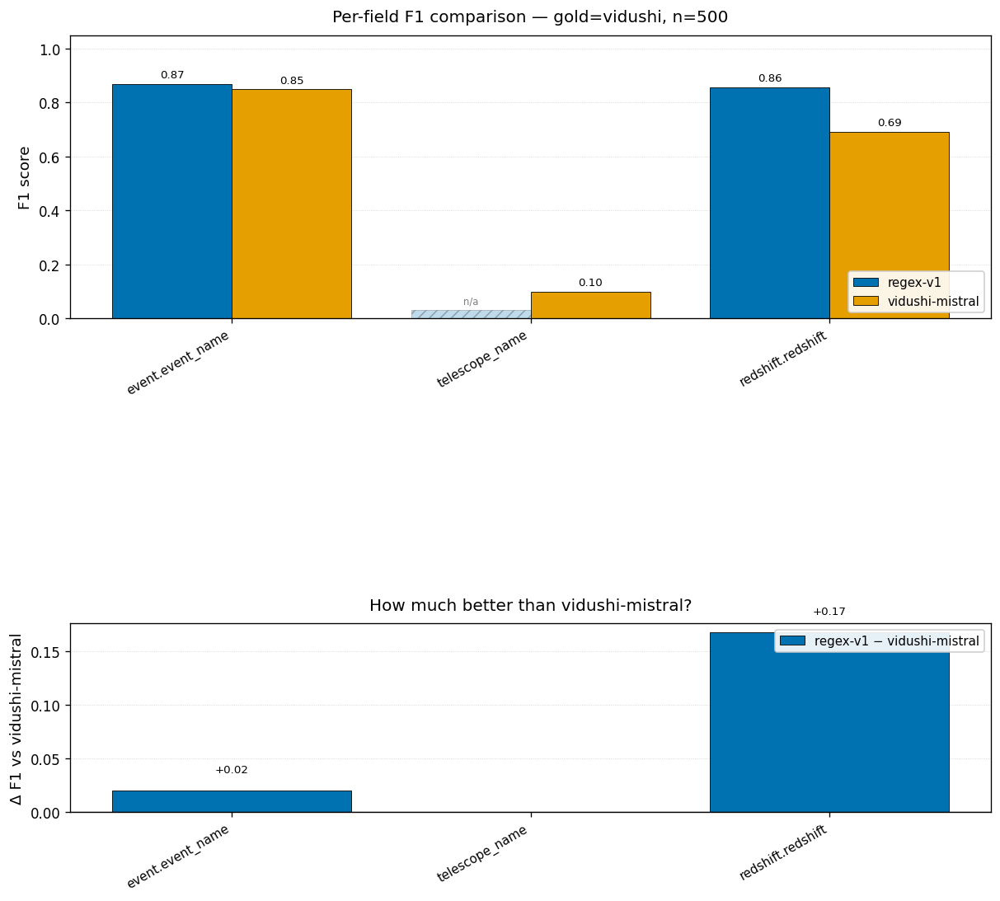

# Circex

**LLM-based structured extractor for GCN optical astronomy circulars.**

Turns the free text of ~18,600 GCN optical observation reports into validated
JSON conforming to [`nasa-gcn/gcn-schema`](https://github.com/nasa-gcn/gcn-schema).
Three extraction engines (regex baseline, Anthropic Claude, local Ollama) all
implement the same `Extractor` protocol. An MCP-style server lets SkyPortal or
any tool query the extracted data.

```
                    ┌──────────────────────────────────────┐
                    │      Tool clients (SkyPortal,        │
                    │      MCP Inspector, your script)     │
                    └──────────────┬───────────────────────┘
                                   │ MCP (TS bridge) OR direct TCP
                                   ▼
┌─────────────────────────────────────────────────────────────┐
│   circex serve  ────  asyncio TCP worker on :8765           │
│   ────────────────────────────────────────────────────────  │
│   9 tools  ◀──  Extraction store (SQLite, WAL)              │
│   regex / Claude / Ollama extractors (Extractor protocol)   │
└──────────────┬──────────────────────────────────────────────┘
               │ on cache-miss: extract on demand
               ▼
   archive_2025/<circular_id>.json   (40,506 raw circulars)
```

See [`GCN_Optical_Extraction_Plan.pdf`](GCN_Optical_Extraction_Plan.pdf) for the
full design.

---

## Pick your path

| You want to... | Jump to |
|---|---|
| Get one circular's structured JSON, right now | [Recipe A](#recipe-a--extract-one-circular) |
| Batch-extract many circulars to files | [Recipe B](#recipe-b--batch-extract-many-circulars) |
| Compare regex vs Vidushi's published Mistral-7B numbers | [Recipe C](#recipe-c--eval-extractors-against-gold) |
| Use Claude (Haiku or Sonnet) instead of regex | [Recipe D](#recipe-d--use-claude-instead-of-regex) |
| Use Ollama (open-source) | [Recipe D2](#recipe-d2--use-ollama-mistral-7b) |
| Run as an MCP server for another tool to query | [Recipe E](#recipe-e--run-as-an-mcp-server) |
| Ask natural-language questions ("what's the redshift of GRB X?") | [Recipe F](#recipe-f--natural-language-demo) |
| Visualize how much better one extractor is than another | [Recipe H](#recipe-h--visualize-extractor-comparisons) |
| Click around in a browser UI | [Recipe I](#recipe-i--browser-front-end) |
| Hand-label circulars for the gold set | [Recipe G](#recipe-g--hand-label-circulars) |
| Read the how-it-works + results summary | [docs/WRITEUP.md](docs/WRITEUP.md) |
| Install from scratch on a fresh machine | [Installation](#installation) |

---

## Quickstart (60 seconds, no API key)

Assumes the repo is cloned, the four reference repos are in `references/`, and
the archive tarball is at `references/circulars-nlp-paper/data/archive_2025.json.tar.gz`.
See [Installation](#installation) otherwise.

```powershell
# Activate the venv
.\.venv\Scripts\Activate.ps1

# (One-time) Untar the archive + build a stratified subset
circex subset-build --max-optical 50000 --per-stratum 100

# Extract 50 circulars with the regex baseline
circex extract --extractor regex --circulars data/labels/hand_v1 --out runs/regex_v1

# Look at one
Get-Content runs/regex_v1/000216.extraction.json
```

That last command prints structured JSON for GCN circular #216 — GRB 990123,
the lens-hypothesis burst. Event name, photometry rows, redshift, GCN
cross-references — and now a `provenance` map giving the character span in
the source text for each populated value — all extracted from prose by the
regex baseline.

---

# Recipes

## Recipe A — Extract one circular

The fastest way to feel what the tool does. Start a long-running worker once,
then query any of the 40,506 circulars in the archive.

```powershell
# Shell 1 — leave this running
circex serve --extractor regex --port 8765 --store data/extractions.sqlite
```

```powershell
# Shell 2 — query any circular ID
python demo/cli_client.py --tool extract_properties --args '{\"circular_id\": 21505}'
```

Output: the full `CircularExtraction` JSON for GCN #21505 (one of the
AT2017gfo / GW170817 optical-counterpart circulars).

Try other IDs: `200`, `12345`, `33123` (GRB 230307A), `40000`. The first call
extracts on demand and caches; second call returns instantly.

**Narrower questions** (read straight from the store):

```powershell
python demo/cli_client.py --tool get_redshift       --args '{\"event\":\"GRB 990123\"}'
python demo/cli_client.py --tool get_photometry     --args '{\"event\":\"GRB 990123\"}'
python demo/cli_client.py --tool get_classification --args '{\"event\":\"GRB 990123\"}'
```

**Example output** for `get_redshift` on GRB 990123:

```json
{
  "redshift": 1.61,
  "redshift_measure": "spectroscopic",
  "redshift_type": "absorption"
}
```

## Recipe B — Batch-extract many circulars

Produces one `<id>.extraction.json` per circular in the output directory.

```powershell
# The 50 stratified circulars
circex extract --extractor regex --circulars data/labels/hand_v1 --out runs/regex_50

# A larger custom set — build a 500-circular subset then extract
circex subset-build --max-optical 50000 --per-stratum 100 --out data/subsets/big.json
circex extract --extractor regex --circulars data/subsets/big.json --out runs/regex_500
```

Each output file is a complete `CircularExtraction` matching the Pydantic
schema in `circex/schema/`.

**Validate the outputs**:

```powershell
# If you treat any of these as candidate labels, use:
circex label-validate runs/regex_50
```

## Recipe C — Eval extractors against gold

Runs an extractor over a gold set and writes a markdown report with per-field
P/R/F1, Δ-vs-Vidushi, cost/latency, and a failure-case browser.

**Against Vidushi's published 13,593-row eval set** (regex-only is free):

```powershell
circex eval --extractors regex --gold vidushi --max-circulars 500 --report reports/eval_regex.md
```

Open `reports/eval_regex.md`. Headline:

| Field | regex F1 | Vidushi Mistral-7B F1 | Δ |
|---|---|---|---|
| event.event_name (GRB#) | 0.869 | 0.849 | **+0.020** |
| redshift.redshift | 0.858 | 0.690 | **+0.168** |

Regex already beats her published numbers on both fields with usable gold
support. With Claude added (next recipe), the gap should widen.

**Against your own hand-labels** (once `data/labels/hand_v1/*.label.json` are
filled in — see [Recipe G](#recipe-g--hand-label-circulars)):

```powershell
circex eval --extractors regex --gold data/labels/hand_v1 --report reports/eval_hand.md
```

## Recipe D — Use Claude instead of regex

Same commands as Recipes A–C, swap `--extractor regex` for `--extractor claude-haiku`
or `--extractor claude-sonnet`.

```powershell
# One-time
$env:ANTHROPIC_API_KEY = "sk-ant-..."

# Batch extract 50 circulars (~$0.05 total with Haiku)
circex extract --extractor claude-haiku --circulars data/labels/hand_v1 --out runs/claude_haiku

# Eval Claude alongside regex (~$0.30 for 100 rows with Haiku)
circex eval --extractors regex,claude-haiku --gold vidushi --max-circulars 100 --report reports/eval_haiku.md

# Use Claude as the worker's default extractor
circex serve --extractor claude-haiku --port 8765 --store data/extractions.sqlite
```

**Cost notes**:
- Haiku 4.5: ~$0.001 / circular. Backfilling all 18,642 optical circulars: ~$20.
- Sonnet 4.6: ~$0.005 / circular. Same backfill: ~$95.
- Anthropic prompt caching is enabled (system block + few-shots are cached
  per 5-minute TTL), reducing real cost by ~30-50%.
- LLM cache (SQLite) reuses identical body × prompt-version × model results
  across runs — `circex eval` reruns are free.

## Recipe D2 — Use Ollama (Mistral-7B)

One-time:

```powershell
# Install Ollama (https://ollama.com). On Mac the Homebrew formula ships
# only the CLI; you also need the .app bundle for the llama-server binary:
#   brew install --cask ollama-app
# On Linux/Windows the standard installer is complete.

# Pull a quantization (the bare `mistral:7b-instruct-v0.2` is NOT a pullable
# tag — only quantized variants are). Q4_K_M is the balanced choice
# (~4 GB, near-FP16 quality, runs well on Apple Silicon and modest GPUs).
ollama pull mistral:7b-instruct-v0.2-q4_K_M    # ~4 GB

# Start the daemon (the .app does this automatically on Mac).
ollama serve
```

Then:

```powershell
circex extract --extractor ollama --circulars data/labels/hand_v1 --out runs/ollama_v1
```

Same shape as Claude but cost = $0 and latency depends on local hardware.
This is the apples-to-apples comparison to Vidushi/Sharma 2026 (she used the
same model architecture; quantization differs).

**Picking a quantization:** the default tag is `mistral:7b-instruct-v0.2-q4_K_M`.
Override with the `CIRCEX_OLLAMA_MODEL` env var to pick a different one:
`-fp16` if you have ≥16 GB of VRAM (closest to S25's setup), `-q8` as a
middle ground, `-q2` for the smallest footprint. Pull the chosen tag first.

**Mistral failure modes are handled gracefully.** The OllamaExtractor
post-processes the model's JSON before validation to recover from common
Mistral-7B output quirks (malformed `provenance` entries, the
`{"X": {"X": null}}` shape on nullable nested objects, list-of-dicts where
the schema expects a comma-joined string, classification aliases like
`"SNIa"` normalized to canonical `"Ia"`, etc.). On the rare circular where
both attempts still fail, the extractor logs a warning and returns an
empty extraction — the eval scores that as null-output (F1 reflects model
quality), rather than crashing the run.

## Recipe E — Run as an MCP server

The Python worker speaks a JSON-line protocol on a local TCP port. Any
language with a TCP client can call it; the included TS LeanMCP bridge in
[`leanmcp_bridge/`](leanmcp_bridge/) translates that to MCP over
streamable HTTP so MCP clients (SkyPortal, MCP Inspector, the Anthropic
Computer-Use SDK) can consume it directly.

**Boot the worker:**

```powershell
circex serve --extractor regex --port 8765 --store data/extractions.sqlite
```

**The 9 tools** the worker exposes:

| Tool | Arguments | Returns |
|---|---|---|
| `extract_properties` | `{circular_id: int}` | full `CircularExtraction` (archive lookup) |
| `extract_text` | `{body: str, circular_id?: int, subject?: str, event_id?: str}` | full `CircularExtraction` (live path, no archive lookup) |
| `get_redshift` | `{event: str}` | `Redshift` or `null` |
| `get_photometry` | `{event: str}` | `list[PhotometryExt]` |
| `get_classification` | `{event: str}` | `Classification` or `null` |
| `find_counterparts` | `{gw_event_id: str}` | `list[FollowUp]` |
| `search_by_position` | `{ra: float, dec: float, radius_arcsec: float, limit?: int}` | cone hits (by separation) |
| `search_gcn_circulars` | `{query: str, event?: str, limit?: int}` | FTS5 hits |
| `fetch_gcn_circulars` | `{circular_ids: list[int]}` | raw archive records |

`extract_text` is the live-pipeline entry point: gcn.circulars (Kafka)
delivers new circulars before they reach the local archive, so an id-based
lookup would fail. Pass the body directly; pass the real `circular_id` when
known so the query store and LLM cache key on it (re-delivered Kafka
messages are then served from cache, not re-extracted). With no
`circular_id` it defaults to `0` and the result is returned but not
persisted to the query store.

`search_by_position` is the position-based join for **un-named** optical
transients: when a circular reports only RA/Dec with no AT/GRB designation,
a name lookup can't find it, but a cone search over stored `localization`
can. Returns `{circular_id, event_name, ra, dec, separation_arcsec}` sorted
by ascending separation. Backed by a dec-band-indexed prefilter plus exact
`astropy` great-circle separation.

**Call from any language** — here's a raw socket example in PowerShell:

```powershell
$client = New-Object System.Net.Sockets.TcpClient("127.0.0.1", 8765)
$stream = $client.GetStream()
$writer = New-Object System.IO.StreamWriter($stream)
$reader = New-Object System.IO.StreamReader($stream)
$writer.WriteLine('{"tool":"get_redshift","arguments":{"event":"GRB 990123"}}')
$writer.Flush()
$reader.ReadLine()
$client.Close()
```

Python clients can use `demo/cli_client.py` as a reference; it's ~30 lines of
`socket.create_connection` + JSON.

**Via the TS LeanMCP bridge** (recommended for any real MCP client):

```bash
# Shell 1 — Python worker (as above)
circex serve --extractor regex --port 8765 --store data/extractions.sqlite

# Shell 2 — TypeScript MCP front-end
cd leanmcp_bridge/
npm install
npm run dev               # boots streamable-HTTP MCP server on :3001
```

MCP clients connect to `http://localhost:3001/mcp`. Health check at
`http://localhost:3001/health`. The 9 tools are auto-registered with full
JSON Schemas; verify with:

```bash
curl -sS -X POST http://localhost:3001/mcp \
  -H 'Content-Type: application/json' \
  -H 'Accept: application/json, text/event-stream' \
  -d '{"jsonrpc":"2.0","id":1,"method":"tools/list","params":{}}'
```

See [`leanmcp_bridge/README.md`](leanmcp_bridge/README.md) for the full
architecture, env vars, and an explanation of the `useDefineForClassFields`
gotcha that's load-bearing for schema generation.

**Pre-populate the store** (so `get_*` queries don't trigger extractions):

```powershell
# Stop the worker first (Ctrl+C), then:
circex index --circulars data/subsets/big.json --extractor regex --store data/extractions.sqlite
# Restart serve.
```

The store is SQLite with WAL mode — you can also keep the worker running and
`circex index` will write concurrently.

## Recipe F — Natural-language demo

The most "demo-able" path. Requires:
- The worker running (Recipe E)
- `$ANTHROPIC_API_KEY` set
- Some extractions already in the store (Recipe A or E backfill)

```powershell
python demo/cli_client.py --question "what's the redshift of GRB 990123?"
```

Claude reads your question, picks `get_redshift` from the tool catalog, calls
the worker, and answers in prose:

> The redshift of GRB 990123 is z = 1.61, measured spectroscopically from
> absorption lines.

Multi-tool questions work too:

```powershell
python demo/cli_client.py --question "what photometry do we have for GRB 990123, and what's the classification?"
```

## Recipe H — Visualize extractor comparisons

Add `--plot` to `circex eval` and you get a 2-panel PNG: top panel = grouped
F1 bars per field across all extractors, bottom panel = Δ vs a chosen baseline.

```powershell
# Install the optional plot extra (matplotlib)
pip install matplotlib

# Generate. The --plot-baseline arg controls what the bottom panel measures
# improvement against — default is regex-v1, but for the Vidushi comparison
# use vidushi-mistral so positive bars = "we beat her".
circex eval --extractors regex --gold vidushi --max-circulars 500 `
  --report reports/eval_v1.md `
  --plot   reports/eval_v1.png `
  --plot-baseline vidushi-mistral
```

Output (regex vs Vidushi's published Mistral-7B baseline, 500 rows):



**How to read it:**

- **Top panel** — F1 per field, side-by-side bars per extractor. Numeric labels
  above each bar. Hatched "n/a" bars mean the extractor didn't try (e.g., the
  regex baseline doesn't extract telescope names) OR the gold set has no
  support for that field.
- **Bottom panel** — `F1(extractor) − F1(baseline)` per field. Positive means
  the extractor beats the baseline; negative means it loses. The bigger the
  bar, the bigger the gap.

**With Claude/Ollama added** (once you've set `$ANTHROPIC_API_KEY` per Recipe D):

```powershell
circex eval --extractors regex,claude-haiku,claude-sonnet,ollama `
  --gold data/labels/hand_v1 `
  --report reports/eval_full.md `
  --plot   reports/eval_full.png `
  --plot-baseline regex-v1
```

Now the top panel shows **5 bars per field** (regex, Haiku, Sonnet, Ollama,
vidushi-mistral when available), and the bottom panel shows how much each LLM
beats the regex baseline on every field — including the hard ones regex can't
do (multi-row photometry tables, in-prose classification).

**Cost-aware reading**: pair the chart with the markdown report's "Cost &
latency" table to see whether a +0.1 F1 gain is worth +$50 of tokens.

## Recipe I — Browser front end

A zero-dependency web UI for clicking around the tools — useful for demos and
for would-be users who don't want a terminal.

```powershell
# Shell 1 — the worker (same as Recipe E)
circex serve --extractor regex --port 8765 --store data/extractions.sqlite

# Shell 2 — the HTTP bridge (stdlib only, no new deps)
python demo/web/serve.py
```

Open <http://127.0.0.1:8080>. Pick a tool, type an event name or circular id
(example chips are provided), hit Run. The page shows a live worker-health
badge, renders photometry as a table, and has a "full JSON" disclosure for
everything.

Architecture: the browser can't speak the worker's raw TCP protocol, so
`demo/web/serve.py` is a ~150-line `http.server` shim that proxies
`POST /api/tool` to the worker. It binds to `127.0.0.1` only, serves exactly
one static file, and allow-lists the 9 tools (the allow-list is unit-tested to
stay in sync with the worker's registry).

For a real SkyPortal-style integration use the TS LeanMCP bridge instead
(Recipe E); this browser front-end is the "could-be users can interact
with it" demo path.

## Recipe G — Hand-label circulars

Producing the gold set for the full-fidelity eval. 50 source files are already
staged in `data/labels/hand_v1/`.

```powershell
# Open the source for one circular
notepad data/labels/hand_v1/000216.source.md

# Fill in the matching label.json per docs/labeling_spec.md
notepad data/labels/hand_v1/000216.label.json

# Validate (catches schema errors, not correctness)
circex label-validate data/labels/hand_v1
```

The labeling spec at [`docs/labeling_spec.md`](docs/labeling_spec.md) defines
the rules per field. As you label, append discovered schema gaps to the
"Known gaps" section. After ~10 labels, run the eval against your gold:

```powershell
circex eval --extractors regex,claude-haiku --gold data/labels/hand_v1 --report reports/eval_hand.md
```

---

# Reference

## Output schema

Every extractor produces a `CircularExtraction` Pydantic model:

```python
class CircularExtraction(BaseModel):
    circular_id: int
    event: Event | None                  # event_name (str or list), instrument trigger IDs
    follow_up: FollowUp | None           # GCN cross-refs, counterpart-of relations
    localization: Localization | None    # RA/Dec (decimal deg, ICRS J2000)
    datetime_: DateTime | None           # trigger time, observation start/stop
    time_offsets: list[TimeOffset]       # literal "T+234s" captures
    photometry: list[PhotometryExt]      # one row per (filter, epoch)
    spectroscopy: SpectralLines | None   # identified emission/absorption lines
    classification: Classification | None # canonical class + confidence + taxonomy_path
    redshift: Redshift | None            # z, error, measure, type
    reporter: Reporter | None            # alerting mission/instrument
    provenance: dict[str, Span]          # dotted field path -> (start, end, snippet)
    extraction_meta: ExtractionMeta      # model, tokens, cost, latency, cache_hit
```

`provenance` is a Circex-internal addition (not part of the upstream PR)
that maps dotted field paths (`"redshift"`, `"photometry[0]"`, or
leaf-level `"redshift.redshift"`) to character-offset spans into the
source `Circular.body`. The regex baseline emits object-level spans; the
LLM extractors are prompted for leaf-level. Every span carries a `snippet`
equal to `body[start:end]` for round-trip verification — a downstream
consumer that re-fetches the circular can confirm the offsets still
resolve to the same text.

**Consuming spans downstream.** Both `model_dump(mode="json")` and
`model_dump_json()` emit `circular_id`, `provenance`, and
`extraction_meta` (with `notes`) verbatim — there's no privileged
in-memory form. ICARE-style consumers can safely copy
`extraction.provenance["redshift.redshift"]` into a SkyPortal
`altdata.note`, or render `extraction_meta.notes` (which is where
bound-redshift phrases like `"redshift_bound: z <= 1.61"` are routed
when the schema can't represent the value as a scalar) as a comment.

**Photometry detection flag + canonical bandpass.** Each `PhotometryExt`
row carries `is_detection` (`True` if `mag` is present, `False` if only
`limiting_mag` — i.e. a non-detection) and `bandpass`, a canonical
sncosmo/SkyPortal filter name derived from the raw `filter` token (which
is always retained). The **complete** set of `bandpass` values the regex
extractor can emit is enumerable, so a downstream crosswalk can be proven
exhaustive:

| raw `filter` | `mag_system` | `bandpass` |
|---|---|---|
| `u` `g` `r` `i` `z` | AB | `sdssu` `sdssg` `sdssr` `sdssi` `sdssz` |
| `y` | AB | `ps1::y` |
| `U` `B` `V` `R` `I` | Vega | `bessellu` `bessellb` `bessellv` `bessellr` `besselli` |
| `J` `H` `K` `Ks` | Vega | `2massj` `2massh` `2massks` `2massks` |
| `clear` `C` | — | `null` (unfiltered) |

The LLM extractors are prompted to follow the same vocabulary but may
emit other recognized filters; an unmapped filter yields `bandpass: null`
with the raw `filter` preserved (never silently dropped).

**Telescope / instrument canonicalization.** `PhotometryExt` also carries
`telescope_canonical` and `instrument_canonical`, auto-derived from the raw
`telescope`/`instrument` strings via a seed alias map
(`circex/data/telescope_aliases.yaml`) — so `"the VLT"`, `"ESO-VLT"`, and
`"VLT/X-shooter"` all canonicalize to `VLT`, and `VT`/`SVOM/VT` collapse to
one name. The raw strings are always retained; an unmapped name yields a
`null` canonical (visible "saw something we couldn't normalize"). The map is
a **seed** — extend it from ICARE's `instrument_id` table; the lookup is
case- and whitespace-insensitive.

**Classification hierarchy + confidence.** `Classification` carries
`confidence` (`[0,1]`, populated by the LLM extractors when the circular
implies a probability) and `taxonomy_path` — the root-to-leaf path through
the time-domain taxonomy, e.g. `Ia` →
`["Time-domain Source", "Stellar variable", "Cataclysmic", "Supernova",
"Type I", "Ia"]`. `taxonomy_path` is auto-derived from the canonical class
on every extractor and always overwrites any supplied value, so a
downstream consumer can collapse to a coarser campaign class by walking up
the path without re-loading the taxonomy.

JSON Schema artifacts for the upstream `nasa-gcn/gcn-schema` PR are dumped to
`schemas/` via `circex schema-dump`.

**Versioning (pin against this).** Each dumped schema carries a semver
`version` field, and `schemas/VERSION` is the single source of truth
(`SCHEMA_VERSION` in `circex/schema/dump.py`). Downstream consumers
(ICARE/SkyPortal) should pin to a version and re-validate their mapping when
it changes. Bump rules: **patch** for additive/descriptive changes,
**minor** for new optional fields, **major** for removed/renamed/retyped
fields or tightened enums (anything that can break an existing consumer). CI
enforces two invariants on every push/PR: the committed artifacts must match
the models (`circex schema-dump` produces no diff), and any change to a
`*.schema.json` artifact must bump `schemas/VERSION` — so a stale pin is
always detectable.

## Project layout

```
circex/
├── schema/        # Pydantic models mirroring gcn-schema + 2 new schemas
├── extract/
│   ├── protocol.py — Extractor protocol + Circular input
│   ├── regex/     # regex baseline (events, coords, mag tables, redshift, classification, dates)
│   └── llm/       # Claude + Ollama extractors, prompt template, chunker
├── eval/          # four-way evaluation harness
├── server/        # long-lived TCP worker + 7 MCP tool implementations
├── cache/         # SQLite-backed LLM cache
├── data/          # corpus loaders (archive, topic-filter, swift-gold, subset)
├── db/            # SQLite + FTS5 schema + indexer (ported from sjhend03/GCNMCP)
├── fetch/         # GCN HTTP poller (ported)
├── search/        # FTS5 search (ported)
└── taxonomy.py    # time-domain-taxonomy YAML loader

demo/cli_client.py   # standalone tool client + Claude-orchestrated NL demo
leanmcp_bridge/      # TS LeanMCP front-end (MCP server on :3001, npm-managed)
schemas/             # JSON Schema artifacts for upstream PR
docs/                # labeling spec, prompt deltas, known issues, runbooks
reports/             # eval + cost-projection outputs
tests/               # 284 tests; pytest tests/ -q
references/          # 4 upstream repos, gitignored
```

## CLI command reference

| Command | What it does |
|---|---|
| `circex extract` | Run one extractor over a circular set, write JSON files |
| `circex eval` | Run extractors against gold, produce a markdown report |
| `circex serve` | Boot the long-lived TCP worker for the 7 MCP tools |
| `circex index --backfill` | Walk a circular set, extract, persist to the SQLite store |
| `circex fetch` | Poll gcn.nasa.gov for new circulars |
| `circex subset-build` | Build a stratified iteration subset from the optical pool |
| `circex schema-dump` | Dump Pydantic models to JSON Schemas (upstream PR artifacts) |
| `circex label-validate` | Validate hand-labeled JSON files against the schema |
| `circex version` | Print the installed version |

All commands accept `--help`.

## The 7 MCP tools (see Recipe E for usage)

See the table in [Recipe E](#recipe-e--run-as-an-mcp-server).

---

## Installation

### Prerequisites

- Python 3.13+ (Python 3.14 supported; CPython on Windows tested)
- Git
- ~30 GB free disk for the archive + reference repos
- Optional: Anthropic API key (Recipe D)
- Optional: Ollama (Recipe D2)
- Optional: Node 20+ for the TS bridge (Recipe E with full MCP shim)

### Fresh setup

```powershell
# 1. Clone
git clone <this repo> Circex
cd Circex

# 2. Create + activate venv
python -m venv .venv
.\.venv\Scripts\Activate.ps1

# 3. Install
pip install -e ".[dev]"

# 4. Clone the four reference repos (gitignored; read-only context)
git clone --depth 1 https://github.com/sjhend03/GCNMCP                       references/GCNMCP
git clone --depth 1 https://github.com/nasa-gcn/gcn-schema                   references/gcn-schema
git clone --depth 1 https://github.com/nasa-gcn/circulars-nlp-paper          references/circulars-nlp-paper
git clone --depth 1 https://github.com/skyportal/timedomain-taxonomy         references/timedomain-taxonomy

# 5. (Optional but recommended) untar the archive + build a subset
circex subset-build --max-optical 50000 --per-stratum 100

# 6. (Optional) configure secrets
Copy-Item .env.example .env
# Edit .env and set ANTHROPIC_API_KEY if you want to use Claude
```

### Why is `tdtax` an optional extra?

The PyPI build of `tdtax` (time-domain-taxonomy) uses `ast.Constant.s` which
was removed in Python 3.14. Circex bypasses the broken package by reading the
YAML files directly from `references/timedomain-taxonomy/tdtax/*.yaml`. You
do **not** need `tdtax` installed; just the `references/` clone.

### Verifying the install

```powershell
pytest -q                          # expect: 284 passed
ruff check .                       # expect: All checks passed!
mypy circex                        # expect: Success: no issues found in 61 source files
circex --help                      # expect: lists the 9 commands above
```

---

## Project status

| Sprint | What landed | Commit |
|---|---|---|
| Sprint 0 | Repo scaffold, ported predecessor Python (db/indexer/search/utils/fetcher), CI | `82bb709` |
| Sprint 1 | All Pydantic schemas, taxonomy loader, ground-truth pipeline, labeling spec | `ed7acf4` |
| Sprint 2 | Regex baseline (6 sub-extractors) + composed `RegexExtractor` + 50 stratified label templates | `a849c45` |
| Sprint 3 | Claude (Haiku/Sonnet, tool-use) + Ollama (Mistral-7B, JSON-mode) extractors, prompt v1, SQLite LLM cache | `c18b3a5` |
| Sprint 4 | Four-way eval harness; regex beats Vidushi by +0.02 / +0.17 F1 on her 2 measurable fields | `92eac45` |
| Sprint 5 | Long-lived TCP worker, 7 MCP tools, ExtractionStore (WAL), demo CLI, TS bridge stub | `e67693e` |
| Sprint 6 | Span-level provenance end-to-end; TS LeanMCP bridge completed (no longer a stub); Ollama extractor sanitizer + fail-soft + correct pullable default tag; 50-row pilot Ollama eval | _uncommitted_ |

284 tests passing. Ruff + mypy strict clean.

### Known issues and open items

See [`docs/known_issues.md`](docs/known_issues.md) for the full catalogue
with severity, status, and code paths. The major open items:

- **Hand-label the 50 staged templates** (Recipe G). Required for the full ~9-field eval.
- **Live LLM eval columns** — Claude eval columns still need a run with
  `$ANTHROPIC_API_KEY` set (Recipe D). Ollama has run on 50 rows;
  the full 500-row column is queued for a faster box.
- **Upstream license audit** — fill in [`docs/upstream_licenses.md`](docs/upstream_licenses.md).
- **Lower/upper-bound redshifts** (`z ≤ 1.61`) — schema doesn't model bounds yet.
- **TS-side bridge integration tests** — the streamable-HTTP MCP front-end
  is wired and `tools/list` returns full schemas, but Node-side tests
  against a mocked TCP worker don't exist yet.

---

## Architecture pointers

- **The plan**: [`GCN_Optical_Extraction_Plan.pdf`](GCN_Optical_Extraction_Plan.pdf)
  (12 pages — goals, schema mapping, 5-phase work plan, decision log).
- **The sprint execution plan**:
  [`~/.claude/plans/come-up-with-a-unified-hopper.md`](~/.claude/plans/come-up-with-a-unified-hopper.md).
- **Prompt deltas vs Vidushi/Sharma 2026**: [`docs/prompt_deltas.md`](docs/prompt_deltas.md).
- **Consistency-pass runbook (A–F)**: [`docs/consistency_passes_runbook.md`](docs/consistency_passes_runbook.md).
- **Per-row photometry epoch (`obs_mjd`) design**: [`docs/design_obs_mjd.md`](docs/design_obs_mjd.md) (proposed; code deferred pending sign-off).

---

## Development

```powershell
pytest -q                          # run all 282 tests
pytest tests/extract/llm -q        # one module
pytest -m live                     # only the live-API tests (off by default)

ruff check .                       # lint
ruff format .                      # auto-format
mypy circex                        # type-check (strict on circex/)

# Regenerate JSON Schema artifacts for the upstream PR
circex schema-dump --out schemas/
```

### Conventions

- Python 3.13+ syntax (`X | None`, not `Optional[X]`)
- `pathlib.Path` everywhere
- Pydantic v2
- `structlog` for logging; no `print` outside CLI command output
- Tests deterministic; live API tests behind `@pytest.mark.live`
- Cache keys include `prompt_version` for clean invalidation
- Cross-platform (Windows-first); CI runs windows + ubuntu

---

## Attribution

Built on patterns from
[sjhend03/GCNMCP](https://github.com/sjhend03/GCNMCP) (MIT). The following
modules were adapted from that repository:

- `circex/db/connection.py` (was `src/db.py`)
- `circex/db/indexer.py` (was `src/indexer.py`)
- `circex/search/fts.py` (was `src/search.py`)
- `circex/extract/regex/regex_events.py` (was `src/utils.py`)
- `circex/fetch/gcn_poller.py` (was `src/fetch_circulars.py`)

Other upstream references (not vendored; read at runtime via
`references/`):

- [nasa-gcn/gcn-schema](https://github.com/nasa-gcn/gcn-schema) — output JSON Schema target. Circex will submit an upstream PR for the `Photometry` extension and the new `SpectralLines` / `Classification` schemas.
- [nasa-gcn/circulars-nlp-paper](https://github.com/nasa-gcn/circulars-nlp-paper) — Sharma et al. 2026: the 40,506-circular archive, topic labels, 13,593-row redshift gold + Vidushi's Mistral-7B baseline predictions.
- [skyportal/timedomain-taxonomy](https://github.com/skyportal/timedomain-taxonomy) — 175-class controlled vocabulary for `Classification`.
- Background paper: Sharma et al. 2026, *ApJS* 283, 30, [arXiv:2511.14858](https://arxiv.org/abs/2511.14858).

## License

MIT. See [`LICENSE`](LICENSE).
